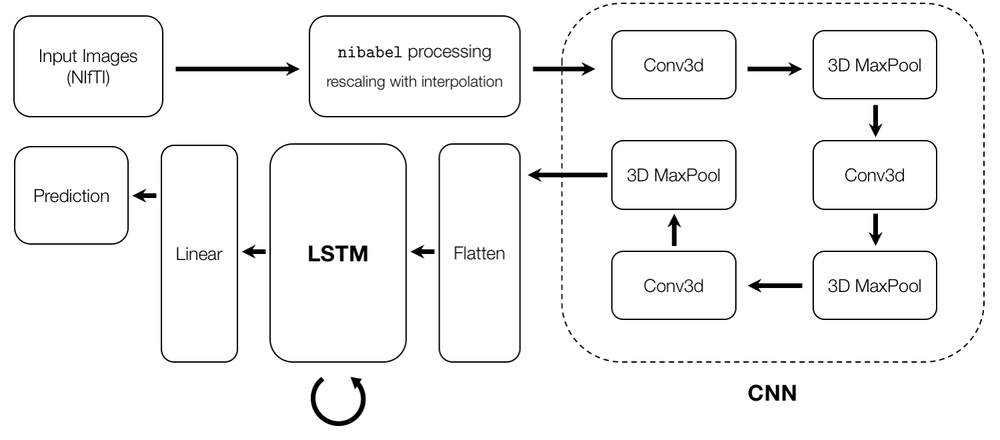

# Prognostic Prediction and Classification of Alzheimer’s Neuroimage Sequences with a Convolutional LSTM Network
A CNN-LSTM deep learning model for prognostic prediction and classification of Alzheimer's MRI neuroimages.

## Abstract

Deep convolutional neural networks augmented with a recurrent LSTM mechanism offer a powerful solution for detecting, classifying, and predicting prognoses of Alzheimer’s in patients based on MRI scans.

Our project develops and trains a deep convolutional LSTM neural network on MRI neuroimage data of Alzheimer’s patients to yield predictive prognoses of future disease progression for individual patients based on previous MRI sequencing. The model takes in a sequence of MRI neuroimages and yields the likelihood of conversion from mild cognitive impairment (MCI) to Alzheimer's disease (AD) as a prognostic prediction.

## Data

Our model is trained on structural MRI scans from the ADNI (Alzheimer's Disease Neuroimaging Initiative) database, which contains neuroimages assigned one of three labels: control (CN), representing no disorder; mild cognitive impairment (MCI); and Alzheimer's disease (AD). Since the exact resolutions of each neuroimage differ across the ADNI studies, the images are preprocessed to normalize dimensions. The images are in NIfTI file format (i.e. `.nii`), which are processed using the `nibabel` library before being converted to tensors for the model.

## Model Architecture

Our prediction network combines a convolutional neural network (CNN), which compresses the neuroimages by extracting learned features; and a long short-term memory (LSTM) cell, which combines the extracted features with those of previously-inputted MRI scans for each patient. The output of the LSTM is fed through a single fully connected layer, to translate the multidimensional LSTM output into a single probability between 0 and 1. This network will be trained to produce the probability that a patient will develop Alzheimer’s within the next five years, weighed against a loss function that aggregates diagnoses for individual patients over time.



### Forward Pass

1. Convolutional Layers (CNN): Take 3-D neuroimage of standard dimensions and apply convolutions and max-pooling.    

        
    
    This process repeats twice, for a total of three 3-D convolutions and three 3-D max-pooling operations.

2. Flatten output layers from CNN into a 1-D tensor of dimension *d*<sub>*l*</sub> for LSTM.    

    

3. LSTM: Combine feature encoding from CNN with feature encodings from past images for patient.    
    New memory *c*<sup>(*t*)</sup> is generated by using the input data *x*<sup>(*t*)</sup> and the past hidden state *h*<sup>(*t*-1)</sup>. (Note that *W* and *U* refer to weights and parameters.)    
    
    
    
    The input gate uses the input data and past hidden state to produce *i*<sup>(*t*)</sup> to gate the new memory, determining what information is valuable and should be remembered. 
    
    
    
    The forget gate, similar to the input gate, uses the input data but determines whether or not the past memory is useful for computing the current memory, determining what information can be "forgotten."
    
    
    
    Using the input gate, the forget gate, and the new memory, the final memory is generated.
    
    
    
    Finally, the output gate (or exposure gate) determines which portions of the memory need to be saved in the hidden state.
    
    

4. Linear Layer: Map from LSTM hidden space (with dimension *d*<sub>*h*</sub>) to prediction space (with dimension *d*<sub>*p*</sub>).    
    
    

5. Compute loss with cross-entropy.    
    
    

Thus, after training, the model takes as input a sequence of MRI scans for a patient and outputs the described probability of a conversion from MCI to AD. A probability of 1 indicates present diagnosis of Alzheimer's disease. Lower probabilities indicate the patient’s distance from incurring a positive diagnosis. 

## Running the Model

### Loading Data
`model/data_loader.py` contains the **data loader** for the MRI neuroimages from ADNI, which are in the NIfTI file format (i.e. `.nii`). In this data loader, the images are loaded on a per-patient basis; by default, the entire ADNI dataset is is used via the dictionaries `AD_Img_Dict.pkl` and `MCI_Img_Dict.pkl`, which contain key-value pairs of the subject ID and the paths to relevant images (i.e. multiple images per subject). These dictionaries are converted to arrays and passed into this dataset, where the paths will be accessed and their neuroimages processed into tensors.

The `data_extraction` folder contains the `ipynb` notebooks which were used to generate `AD_Img_Dict.pkl` and `MCI_Img_Dict.pkl`. If you'd like to modify what data is being passed into the model, `.pkl` files containing `{subjectID : image_paths}` pairs simply need to be passed to the data loader.

### Testing Local Environment
The `data_sample` folder is provided to test your local environment and the model on a small sample of data. This contains `.nii` neuroimage files for several patients.

### Training and Evaluation
`evaluate.py` is a unified script for training and evaluation.

```
python evaluate.py
```

If running without GPU (while not recommended), CUDA can be disabled with the following.

```
python evaluate.py --disable-cuda
```

Additionally, an alternative script is provided to reduce memory usage by storing the MRI data in half-tensors.

```
python evaluate_half_tensor.py [--disable_cuda]
```

---

<em>"Prognostic Prediction and Classification of Alzheimer’s Neuroimage Sequences with a Convolutional LSTM Network" is a project for CS 452/663: Deep Learning Theory and Applications, Spring 2020, by Faiaz Rahman, Jamie Nachbar, Kincaid McDonald, and Paul Han.</em>
